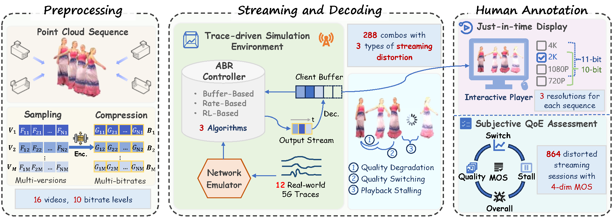

# TAPS
TAPS: A Trace-Driven Dataset for QoE-Aware Adaptive Point Cloud Streaming
The dataset is available at OneDrive: https://1drv.ms/f/c/3dbe3858aa085846/IgBPKYnxuv5mRJs4TmJ8AvPJAd4iNPzlwE7pkr3zF29HA34?e=qD9pqj

## Overview

The **TAPS Dataset** is a large-scale dynamic point cloud streaming dataset designed to support research on:

- Adaptive Bitrate (ABR) algorithms
- Dynamic point cloud streaming
- Quality of Experience (QoE) modeling
- Objective quality assessment
- Streaming system optimization

Unlike conventional point cloud quality datasets, TAPS provides an **end-to-end streaming framework**, covering the full pipeline from spatial downsampling and compression to network-aware adaptive streaming and subjective evaluation.

---

## Key Features

- Multi-representation point cloud streaming
- Multiple bandwidth traces
- Multiple ABR strategies
- Multi-dimensional subjective quality scores
- Realistic streaming behaviors
- End-to-end streaming pipeline

---

## Dataset Summary

| Attribute | Value |
|----------|------|
| #Sequences | 16 (8 for 10-bit & 8 for 11-bit) |
| #Frames per Sequence | 250 (UVG-VPC) / 300 (8i)|
| #Representations | 10 levels |
| #Bandwidth Profiles | 12 (6 for each bit depth) |
| #ABR Algorithms | 3 |
| #Display Resolutions | 720P, 1080P, 2k, 4k |
| #Streaming Sessions | 864 |
| #Subjective Scores | 3456 |
| Point Cloud Format | `.ply` |
| Bitstream Format | `.drc` |
| Frame Rate | 25 fps /30 fps |
| Chunk Duration | 1 second |

---

## Dataset Pipeline

The TAPS dataset is generated through the following end-to-end pipeline:
Raw Point Cloud Sequences
↓
Spatial Downsampling
↓
Compression (Draco)
↓
ABR Streaming
↓
Rendering
↓
Subjective Evaluation

Each streaming session corresponds to a unique combination of:

- Source Sequence
- Bandwidth Trace
- ABR Strategy
- Display Resolution

---

### Subjective Quality Dimensions

Each streaming session is evaluated using:

- Spatial Quality
- Quality Switch
- Playback Stalling
- Overall QoE

MOS range: 1-10

