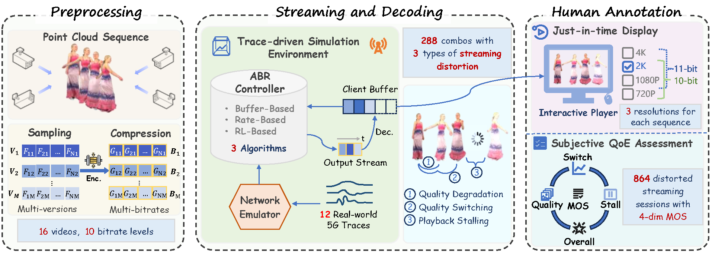

# TAPS
TAPS: A Trace-Driven Dataset for QoE-Aware Adaptive Point Cloud Streaming

The dataset is available at OneDrive: https://1drv.ms/f/c/3dbe3858aa085846/IgBPKYnxuv5mRJs4TmJ8AvPJAd4iNPzlwE7pkr3zF29HA34?e=qD9pqj

## Overview

The **TAPS Dataset** is a large-scale dynamic point cloud streaming dataset designed to support research on:

- Adaptive Bitrate (ABR) algorithms
- Dynamic point cloud streaming
- Quality of Experience (QoE) modeling
- Objective quality assessment
- Streaming system optimization

Unlike conventional point cloud quality datasets, TAPS provides an **end-to-end streaming framework**, covering the full pipeline from spatial downsampling and compression to network-aware adaptive streaming and subjective evaluation.

---

## Key Features

- Multi-representation point cloud streaming
- Multiple bandwidth traces
- Multiple ABR strategies
- Multi-dimensional subjective quality scores
- Realistic streaming behaviors
- End-to-end streaming pipeline

---

## Dataset Summary

| Attribute | Value |
|----------|------|
| #Sequences | 16 (8 for 10-bit & 8 for 11-bit) |
| #Frames per Sequence | 250 (UVG-VPC) / 300 (8i)|
| #Representations | 10 levels |
| #Bandwidth Profiles | 12 (6 for each bit depth) |
| #ABR Algorithms | 3 |
| #Display Resolutions | 720P, 1080P, 2k, 4k |
| #Streaming Sessions | 864 |
| #Subjective Scores | 3456 |
| Point Cloud Format | `.ply` |
| Bitstream Format | `.drc` |
| Frame Rate | 25 fps /30 fps |
| Chunk Duration | 1 second |

---

## Dataset Pipeline

The TAPS dataset is generated through the following end-to-end pipeline:
Raw Point Cloud Sequences
↓
Spatial Downsampling
↓
Compression (Draco)
↓
ABR Streaming
↓
Rendering
↓
Subjective Evaluation

Each streaming session corresponds to a unique combination of:

- Source Sequence
- Bandwidth Trace
- ABR Strategy
- Display Resolution

---

### Subjective Quality Dimensions

Each streaming session is evaluated using:

- Spatial Quality
- Quality Switch
- Playback Stalling
- Overall QoE

---

### More Baseline Evaluations

Performance of existing metrics under different resolutions

| Metric | Resolution | PLCC ↑ | SRCC ↑ | RMSE ↓ |
| :--- | :---: | :---: | :---: | :---: |
| $\text{PSNR}_{\text{proj}}$ | 4k | 0.704 | 0.676 | 0.615 |
| | 2k | 0.637 | 0.631 | 1.057 |
| | 1080p | 0.740 | 0.672 | 0.784 |
| | 720p | 0.607 | 0.448 | 1.029 |
| $\text{SSIM}$ | 4k | 0.670 | 0.629 | 0.642 |
| | 2k | 0.566 | 0.510 | 1.130 |
| | 1080p | 0.727 | 0.650 | 0.801 |
| | 720p | 0.462 | 0.449 | 1.148 |
| $\text{BRISQUE}$ | 4k | 0.610 | 0.489 | 0.686 |
| | 2k | 0.448 | 0.411 | 1.226 |
| | 1080p | 0.676 | 0.464 | 0.859 |
| | 720p | 0.411 | 0.333 | 1.180 |
| $\text{NIQE}$ | 4k | 0.606 | 0.590 | 0.689 |
| | 2k | 0.389 | 0.398 | 1.263 |
| | 1080p | 0.530 | 0.430 | 0.988 |
| | 720p | 0.292 | 0.187 | 1.238 |
| $\text{VMAF}$ | 4k | 0.135 | 0.124 | 0.858 |
| | 2k | 0.374 | 0.382 | 1.272 |
| | 1080p | 0.497 | 0.516 | 1.011 |
| | 720p | 0.580 | 0.586 | 1.055 |
| $\text{VIF}$ | 4k | 0.581 | 0.570 | 0.705 |
| | 2k | 0.540 | 0.565 | 1.154 |
| | 1080p | 0.642 | 0.570 | 0.894 |
| | 720p | 0.520 | 0.458 | 1.106 |
| $\text{GraphSIM}$ | 4k | 0.751 | 0.718 | 0.571 |
| | 2k | 0.628 | 0.561 | 1.067 |
| | 1080p | 0.714 | 0.535 | 0.816 |
| | 720p | 0.586 | 0.546 | 1.049 |
| $\text{PCQM}$ | 4k | 0.729 | 0.682 | 0.592 |
| | 2k | 0.727 | 0.735 | 0.942 |
| | 1080p | 0.730 | 0.693 | 0.797 |
| | 720p | 0.616 | 0.562 | 1.020 |
| $\text{PSNR}_{\text{Y}}$ | 4k | 0.609 | 0.555 | 0.687 |
| | 2k | 0.582 | 0.579 | 1.115 |
| | 1080p | 0.605 | 0.580 | 0.928 |
| | 720p | 0.606 | 0.594 | 1.030 |
| $\text{PSNR}_{\text{p2p}}$ | 4k | 0.675 | 0.664 | 0.638 |
| | 2k | 0.702 | 0.700 | 0.977 |
| | 1080p | 0.705 | 0.582 | 0.827 |
| | 720p | 0.775 | 0.703 | 0.817 |
| $\text{AFQNet}$ | 4k | 0.354 | 0.346 | 0.809 |
| | 2k | 0.441 | 0.406 | 1.231 |
| | 1080p | 0.580 | 0.398 | 0.949 |
| | 720p | 0.422 | 0.371 | 1.174 |

Performance of existing metrics under different ABR strategies：

| Metric | ABR | PLCC ↑ | SRCC ↑ | RMSE ↓ |
| :--- | :---: | :---: | :---: | :---: |
| $\text{PSNR}_{\text{proj}}$ | BB | 0.816 | 0.827 | 0.697 |
| | RB | 0.607 | 0.602 | 0.820 |
| | RL | 0.608 | 0.611 | 1.026 |
| $\text{SSIM}$ | BB | 0.825 | 0.830 | 0.680 |
| | RB | 0.651 | 0.624 | 0.783 |
| | RL | 0.359 | 0.345 | 1.206 |
| $\text{BRISQUE}$ | BB | 0.780 | 0.783 | 0.754 |
| | RB | 0.449 | 0.433 | 0.922 |
| | RL | 0.218 | 0.187 | 1.261 |
| $\text{NIQE}$ | BB | 0.491 | 0.516 | 1.049 |
| | RB | 0.332 | 0.161 | 0.973 |
| | RL | 0.300 | 0.273 | 1.233 |
| $\text{VMAF}$ | BB | 0.448 | 0.428 | 1.077 |
| | RB | 0.190 | 0.213 | 1.013 |
| | RL | 0.625 | 0.586 | 1.008 |
| $\text{VIF}$ | BB | 0.506 | 0.452 | 1.039 |
| | RB | 0.443 | 0.434 | 0.925 |
| | RL | 0.519 | 0.519 | 1.104 |
| $\text{GraphSIM}$ | BB | 0.778 | 0.769 | 0.757 |
| | RB | 0.643 | 0.612 | 0.790 |
| | RL | 0.443 | 0.352 | 1.158 |
| $\text{PCQM}$ | BB | 0.672 | 0.627 | 0.892 |
| | RB | 0.597 | 0.575 | 0.827 |
| | RL | 0.658 | 0.583 | 0.973 |
| $\text{PSNR}_{\text{Y}}$ | BB | 0.569 | 0.480 | 0.991 |
| | RB | 0.519 | 0.480 | 0.882 |
| | RL | 0.400 | 0.395 | 1.184 |
| $\text{PSNR}_{\text{p2p}}$ | BB | 0.699 | 0.771 | 0.862 |
| | RB | 0.632 | 0.623 | 0.800 |
| | RL | 0.731 | 0.610 | 0.881 |
| $\text{AFQNet}$ | BB | 0.532 | 0.510 | 1.020 |
| | RB | 0.384 | 0.308 | 0.952 |
| | RL | 0.259 | 0.223 | 1.248 |
